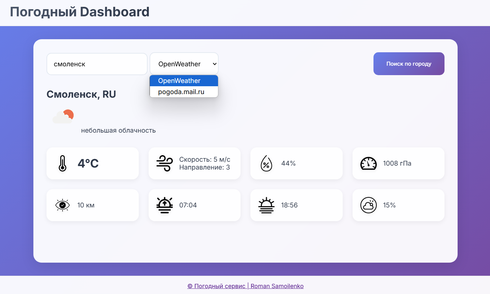

# Погодный Дашборд

Приложение имеет серверную часть, написанную на языке **Go**, и фронтенд, разработанный с использованием **JavaScript**, **HTML** и **CSS**. Для сбора данных о погоде используется **API OpenWeather**, а также скрапинг страницы погоды на сайте **Mail.ru**.

## Функциональность
- **Выбор источника погоды**: Пользователь может выбрать, из какого источника получать данные о погоде.
- **Ввод города**: Возможность ввода любого города для получения актуальной информации о погоде.
- **Страница статистики сервера**: Доступна страница, отображающая загруженность и характеристики бэкенд-сервера.

## Используемые технологии
- **API и REST API** для взаимодействия с сервисом OpenWeather.
- **Scraping/Parsing** для сбора данных с веб-страниц с pogoda.mail.ru.
- **Go** для разработки серверной(бекэнд) части.
- **JavaScript**, **HTML**, **CSS** для фронтенда.
- **Middleware**: Используется для обработки и фильтрации входящих запросов.
- **Логирование (slog)**: Реализовано с использованием библиотеки **slog** для отслеживания и анализа событий в приложении.
  
## Screenshots

